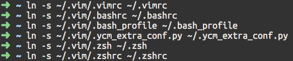

**Installation**:

```
git clone https://github.com/dipta10/MacVim.git ~/.vim
```

Create symblinks:

```
ln -s ~/.vim/.vimrc ~/.vimrc &&
ln -s ~/.vim/.bashrc ~/.bashrc &&
ln -s ~/.vim/.bash_profile ~/.bash_profile &&
ln -s ~/.vim/.ycm_extra_conf.py ~/.ycm_extra_conf.py &&
ln -s ~/.vim/.zsh ~/.zsh &&
ln -s ~/.vim/.zshrc ~/.zshrc
```



